# Instalar-ubuntu

## Sobre Ubuntu, ¿Que es Ubuntu?

La distribución de Ubuntu representa lo mejor de lo que la comunidad mundial de software ha compartido con el mundo. Ubuntu es una distribución Linux basada en Debian GNU/Linux, que incluye principalmente software libre y de código abierto.

Puede utilizarse en ordenadores y servidores. Está orientado al usuario promedio, con un fuerte enfoque en la facilidad de uso y en mejorar la experiencia del usuario. Está compuesto de múltiple software normalmente distribuido bajo una licencia libre o de código abierto. Estadísticas web sugieren que la cuota de mercado de Ubuntu dentro de las distribuciones Linux es, aproximadamente, del 52 %,3​4​ y con una tendencia a aumentar como servidor web.

 [Referencia wikipedia] (https://es.wikipedia.org/wiki/Ubuntu) 
 
## Como puedo instalarlo?

### 1. Descargar VirtualBox

• Se puede descargar VirtualBox 
con el siguiente enlace:

https://www.virtualbox.org/wiki/Downloads

### 2. Instalar VirtualBox

• Una vez descargado, diríjete a la localización del paquete en tu
equipo (generalmente en el directorio “Descargas”) y ejecútalo
como administrador haciendo clic derecho.

• Comienza la instalación y espera hasta su finalización.

### 3. Descargar una Imagen ISO

Los archivos ISO proporcionan una imagen completa de un CD o DVD.
Montar una imagen ISO en VirtualBox ofrece la misma experiencia que
insertar un CD o DVD físico en cualquier computadora para instalar un
programa.

Por lo tanto, es necesario contar primero con la Imagen ISO del sistema
operativo que desea montar como máquina virtual en VirtualBox. Para
esto, utilizaremos el ISO :

[ubuntu-22.04.2-desktop-amd64.iso] (https://releases.ubuntu.com/jammy/)

Aunque tambien podemos usar cualquiera de lista de sistemas operativos libres,
pertenecientes a la familia de distribuciones Linux:

Ubuntu: https://ubuntu.com/

En esta ocasión, usaremos la imagen ISO de la distribución “Ubuntu”,
una de las más populares y de uso extendido. Puede ser descargada a
través de los recuros que encontramos en google.

### 4. Montar una máquina virtual Ubuntu

#### 1.)

Una vez instalado e iniciado VirtualBox, crearemos la máquina virtual pulsando el icono de «Nueva».

VirtualBox nos pedirá que introduzcamos el nombre de la máquina virtual junto con el tipo y la versión que vayamos a usar. En este caso el tipo será «Linux» y la versión será «Ubuntu (64-bit)». 

El nombre puedes introducir el que quieras. Este será el que te permita identificar la máquina virtual en caso de tener más de una. Además de esto, te permite introducir la carpeta donde alojar los archivos de la máquina virtual. 

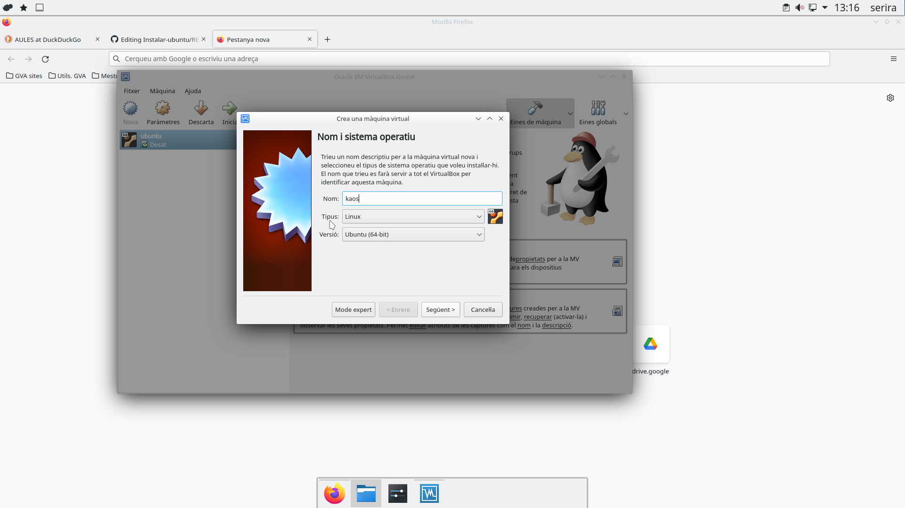

 #### 2.)

En el siguiente paso, debemos indicarle la memoria principal (RAM) que tendrá nuestra máquina virtual. En este caso Ubuntu recomienda escoger un tamaño mínimo de 2048MB (2GB) para sistemas virtualizados para que todo funcione correctamente.

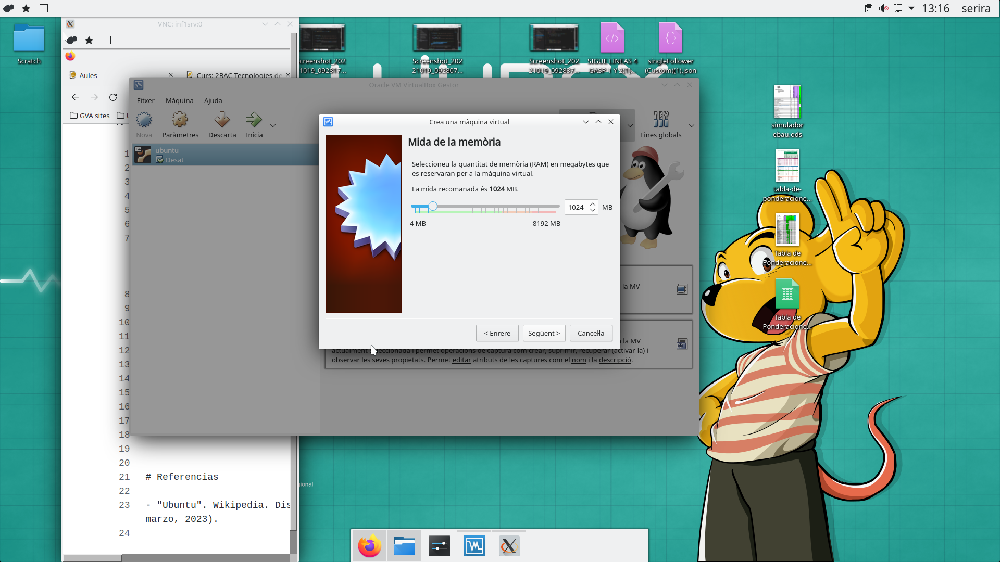

#### 3.)

 En segundo lugar, VirtualBox nos pedirá como configurar el disco duro. En este caso crearemos un disco virtual. El resultado de este paso será creación de un archivo que simulará el disco duro de tu máquina virtual. Como podemos ver en la segunda imagen, nos preguntará que tipo de archivo de disco duro queremos usar. 

Todos los formatos presentados son válidos para nuestro uso. Básicamente las principales características de estos son que VDI es el formato predeterminado de VirtualBox.

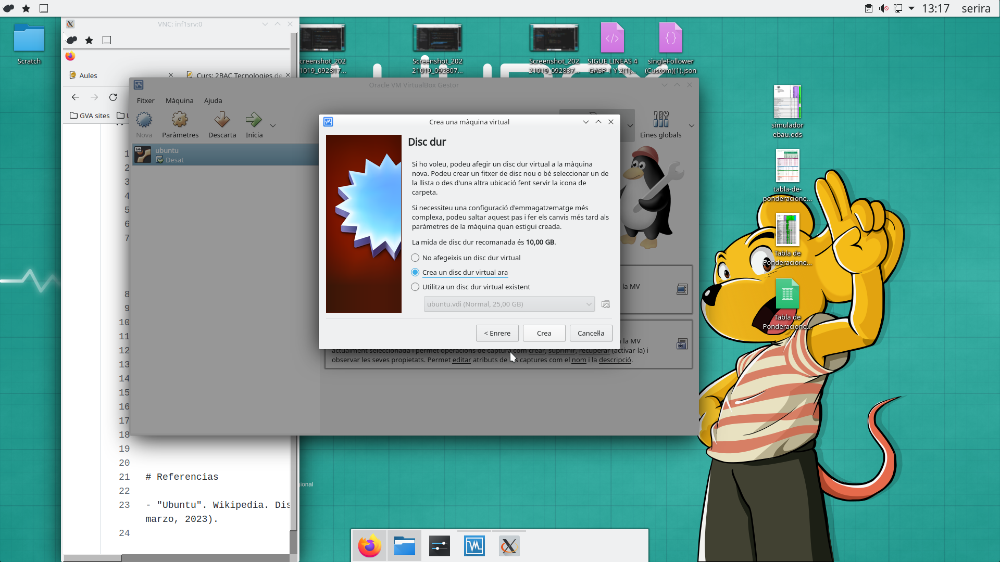

En este punto ya tenemos creada nuestra máquina virtual con las opciones seleccionadas en los pasos anteriores. En la pantalla principal podemos ver como aparecen todas las características que hemos seleccionado en el proceso de creación de la máquina, aunque nos faltan algunas cosas por configurar. 

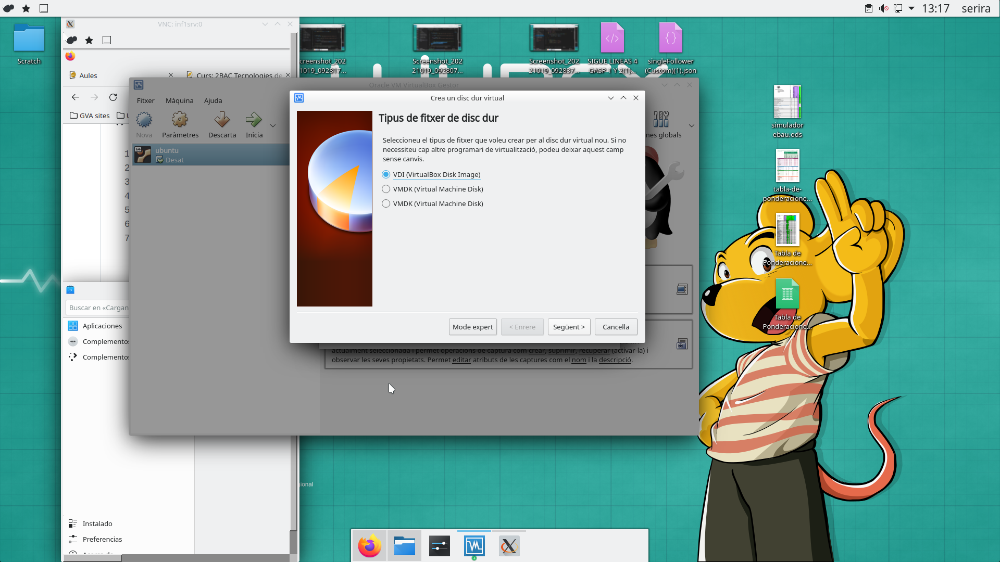

Los puntos que nos quedan por completar, se configurarán en el proceso de instalación del sistema operativo. La forma de iniciar este proceso será accediendo al menú «Configuración».

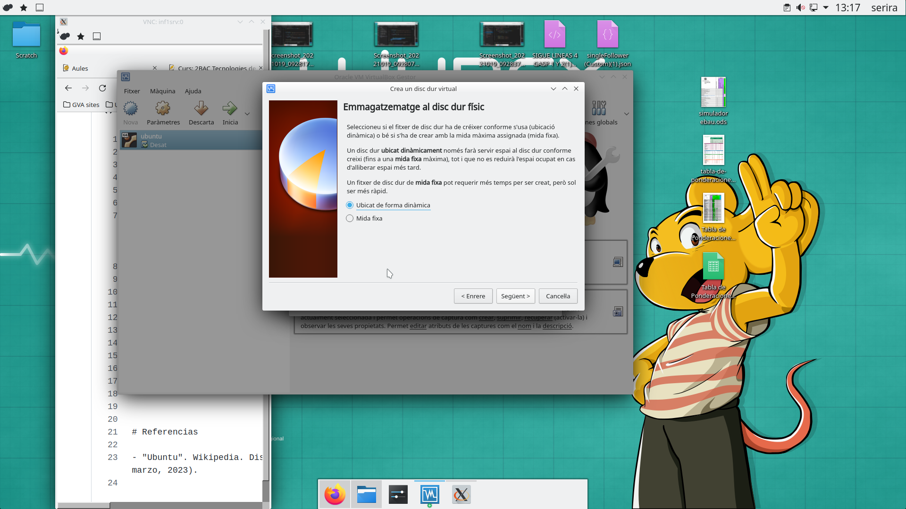

#### 4.)

Para poder usar una máquina virtual tienes que activar la virtualización en tu equipo. Normalmente esto ya viene activado por defecto, pero no siempre es el caso. Ahora crearemso la maquina virtual. 

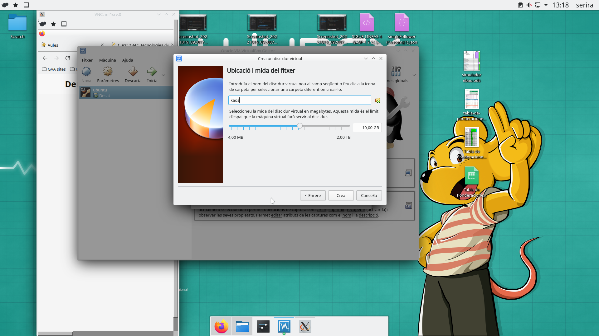

### 5. Instalación del Ubuntu en el ordenador

#### 5.)

 El último paso para poder disfrutar de un sistema operativo Linux en nuestra máquina virtual es la instalación del sistema operativo. Para comenzar dicha instalación debemos seleccionar ,»Iniciar», teniendo marcada la máquina virtual configurada anteriormente.

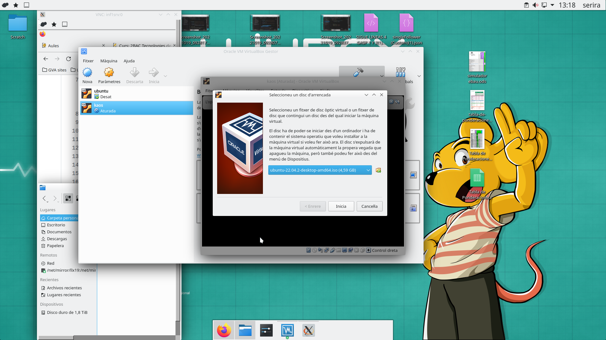

#### 6.)

 Se abrirá una ventana de inicio del sistema operativo. Normalmente al principio hace un chequeo de errores en el disco. Simplemente tenemos que dejar que este termine.

Antes de iniciar la instalación, cabe destacar que puede que en algún momento no veamos el ratón fuera de la ventana de VirtualBox. Esto puede ocurrir debido a que el programa captura nuestro ratón como si perteneciese a la máquina virtual que estamos instalando. 

Para poder usar el ratón fuera de nuestra máquina virtual debemos pulsar la tecla «Control» de la derecha del teclado.

Cuando el chequeo termine, obtendremos la pantalla mostrada en la siguiente imagen. En ella nos pregunta si queremos probar o directamente instalar Ubuntu. Pulsaremos en probarlo y más adelante lo instalaremos. Cabe destacar que puedes elegir el idioma que prefieras seleccionándolo a la izquierda.

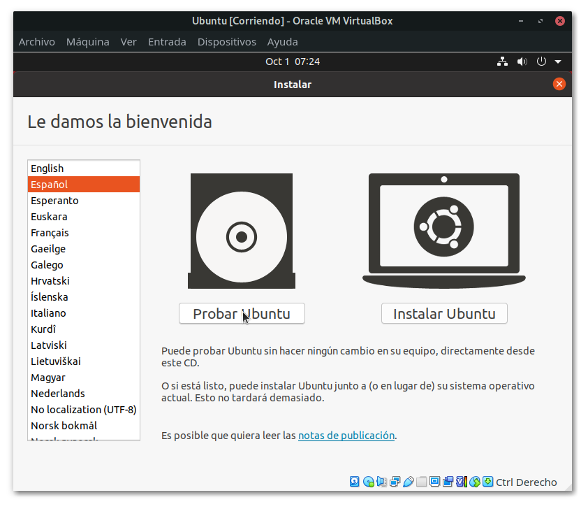

#### 7.)

Se iniciará Ubuntu. Ahora mismo lo podríamos usar como si ya estuviese instalado, pero nada de esto se nos guardaría, por lo que vamos a proceder a instalarlo. Antes de esto, para hacer más cómoda la instalación, vamos a cambiar la resolución de la ventana para poder verla a un tamaño normal. 

Para esto pulsaremos en los tres iconos de arriba a la derecha y en el menú desplegable que aparece pulsaremos en «Configuración» .Una vez se abra la configuración, en el menú de la izquierda bajaremos hasta encontrar el apartado «Monitores». Pulsaremos y nos saldrán 4 opciones que modificar. En este caso nos centraremos en la resolución, la cual puedes cambiar a tu gusto.

Tras cambiar la resolución, si todo se ve correctamente, le indicamos que queremos «Mantener cambios» y cerramos la ventana de configuración.

#### 8.)

Una vez de nuevo en el escritorio, veremos un icono llamado «Instalar Ubuntu 20.04.1 LTS». Pulsaremos sobre él para la iniciar la instalación. En el instalador como vemos en las siguientes imágenes, lo primero que nos pedirá será el idioma y la configuración del teclado. 

Normalmente, si estás conectado a internet ambos se detectarán automáticamente, pero si quieres otra configuración, podrás cambiarla sin ningún problema.

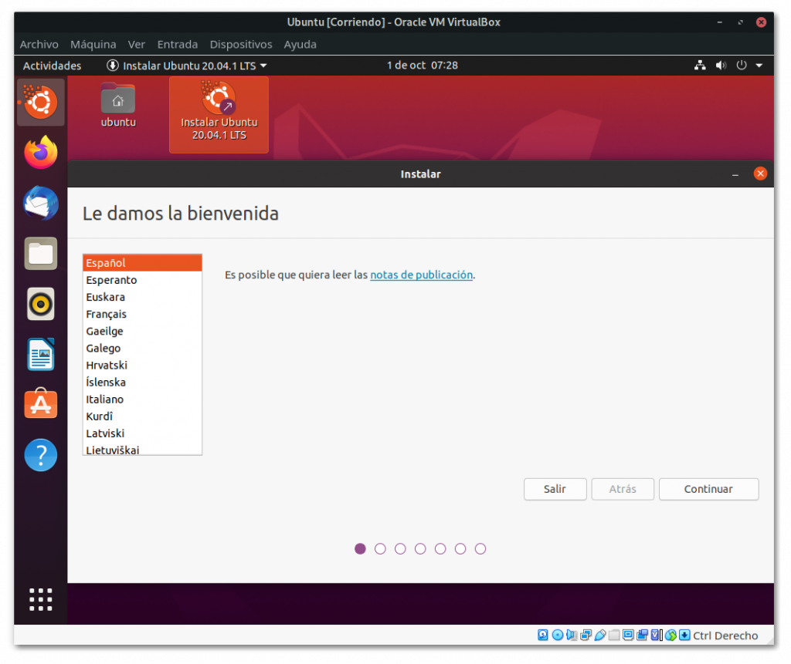

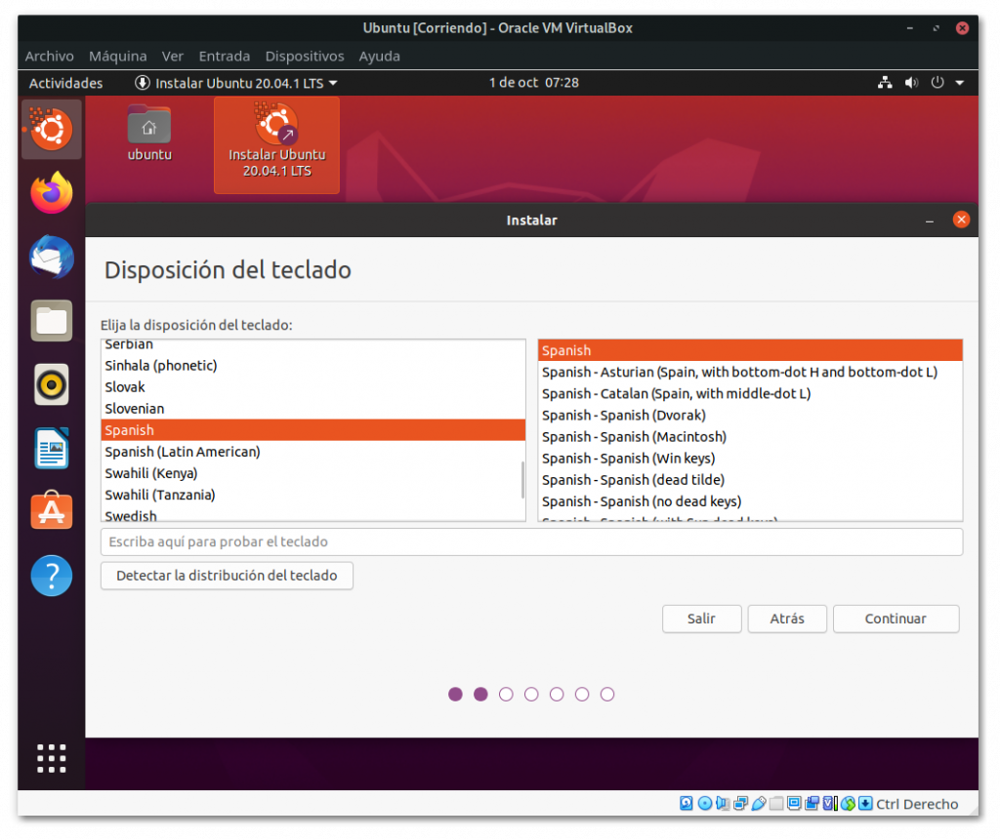

#### 9.) 

En el siguiente paso nos preguntará qué tipo de instalación queremos hacer. En este caso seleccionaremos la instalación normal, con actualizaciones de Ubuntu. Puede que al realizar este paso, la ventana se vuelva pequeña de nuevo. Si esto es así, sin cerrar la ventana de instalación, vuelve a realizar los pasos que se indicaron antes para cambiar la resolución.

Tras esto, el instalador nos pregunta dónde queremos instalar Ubuntu. Aquí seleccionaremos que queremos «Borrar el disco e instalar Ubuntu». Cabe destacar que esto no borrará nada del disco de tu ordenador personal, si no que borrará el disco virtual que creamos previamente en VirtualBox.

#### 10.) 

El instalador nos pedirá que indiquemos donde nos encontramos para ajustar nuestra zona horaria. Bastará con pulsar el país en el que te encuentres, para que este ajuste la zona horaria pertinente.

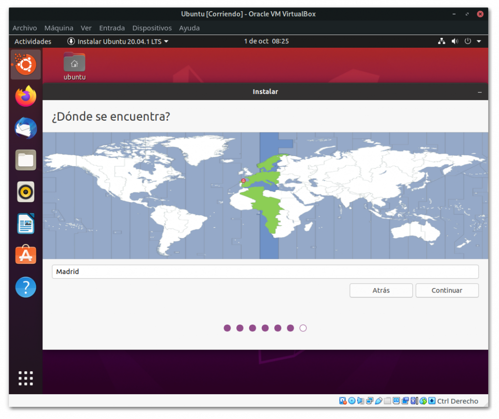

#### 11.)  

Como siguiente y último paso antes del inicio de la instalación, Ubuntu nos solicitará el nombre del equipo, el nombre de usuario y la contraseña. Rellenaremos el formulario e indicaremos si queremos o no poner la contraseña al iniciar una sesión. Cabe destacar que debes poner una contraseña que posteriormente recuerdes, ya que esta se necesitará para instalar programas y administrar tu sistema operativo.

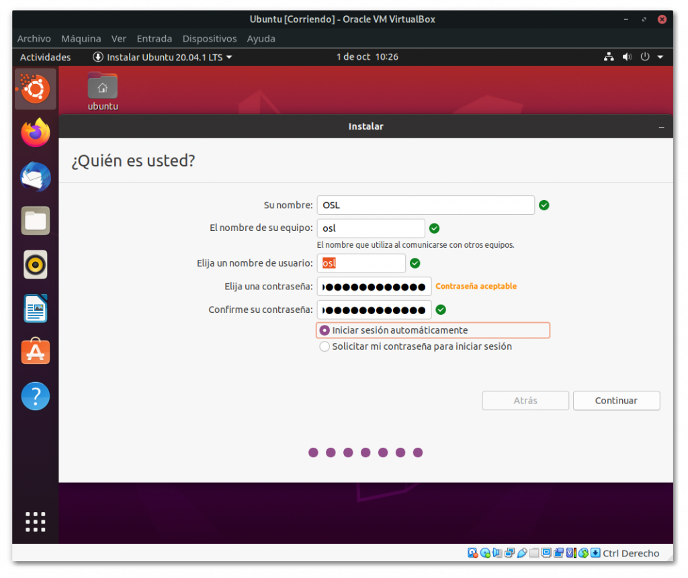

#### 12.) 

Ya completado este paso, comenzará la instalación. Tendremos que esperar hasta que finalice y cuando esta termine reiniciar la máquina virtual. Al reiniciar la máquina virtual, antes de que se apague la máquina nos pedirá que extraigamos el medio de instalación y pulsemos «Enter». Como es una máquina virtual y no tenemos medio de instalación simplemente pulsaremos la tecla «Intro».

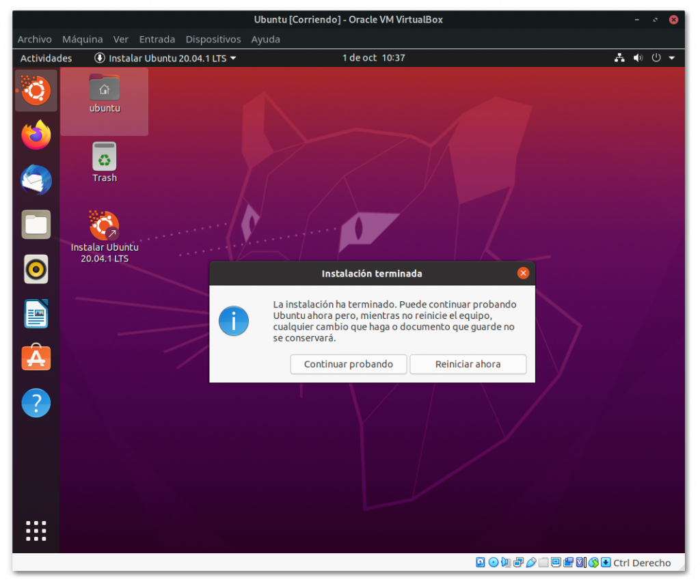

##### Una vez llegado a este punto, ya tendrás la máquina virtual completamente funcional. 

## Actualización del sistema

Para actualizar el sistema de Ubuntu haremos uso de la maquina virtual "virtual box"

### Actualización desde linea de comandos

### Actualización desde el interfaz gráfico

### Actualización con synaptic

#  Instalación de software

### Con ubuntu store

### Mediante SYNAPTIC 

### Con APT

